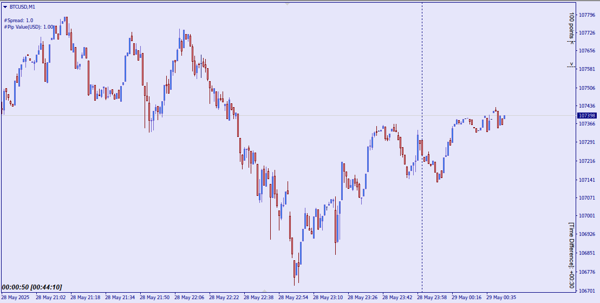

# VisionX-indicator

قابلیتها:
۱. نمایش اسپرد+پیپ ولیو+تفاوت تایم لوکال با بروکر+زمان باقی مانده تا کلوز کنده+یه لیبل پیپ متر که میتونید مقدارشو هرچی خواستید بدید هر چی هم نخواستید میتونید از تنظیمات بردارید

۲. یه خط-مستطیل روی چارت بکشید کلید:
1
رو بزنید بعد روی خط/مستطیلی که کشیدید کلیک کنید
با رعایت قیمت محدوده رو تا جایی امتداد میده که قیمت بهش برخورد داشته باشه لازم نیست دیگه با موس خودتونو اذیت کنید

۳. هر چندتا خط/مستطیل/... خواستید انتخاب کنید دیگه لازم نیست دونه دونه رنگ و ضخامت عوض کنید
بعد ازینکه سلکت کردید این دکمه ها برای تنظیم ضخامت هستش: 
q-w-e
دکمه های رنگی:
 g-r-t-p-k-y-b

۴. هر چندتا مستطیل خواستید انتخاب کنید با زدن کلید
 پ ~ 
که معمولا زیر کلید Esc یا اطراف کلید Enter هستش

۵. با کلید 
tab
میتونید اسکیل چارت رو تنظیم کنید

۶.اگه میخواید فیبوی ریسک ریوارد رسم کنید کلید:
2
برای رسم فیبو سه قسمتی کلید:
3
برای رسم فیبوی چهار قسمتی کلید:
4

۷. برای اینکه همه چیز چارتتونو پاک کنید کلید:
0
